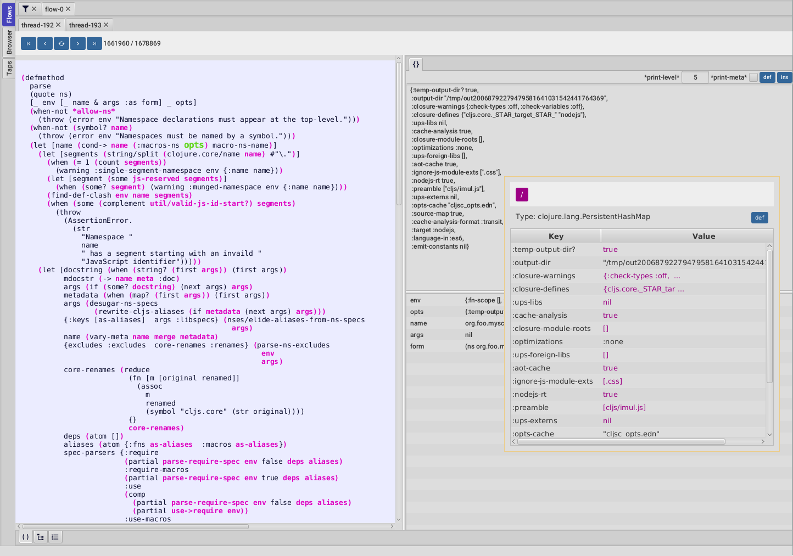
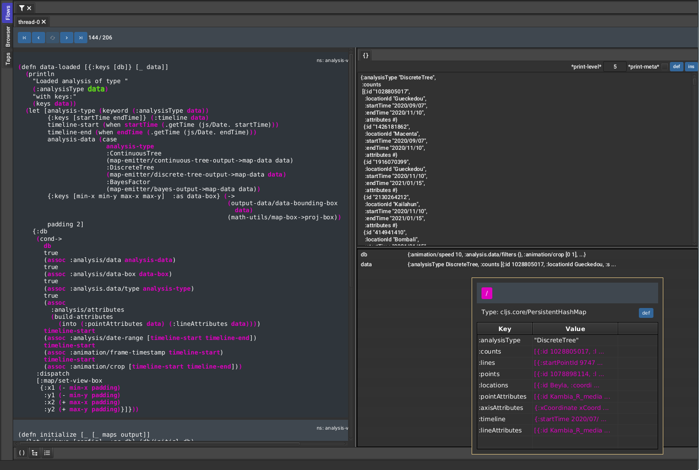
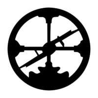

# Flow-storm debugger

A tracing debugger for Clojure and ClojureScript

# Clojure has the repl, does it need a debugger?

I gave a talk recently for the London Clojurians, the first slide goes about my answer to this :
https://www.youtube.com/watch?v=A3AzlqNwUXc&t=934s

# Artifacts

Debugger GUI artifact :

Instrumentation artifact :

# Prerequisites

	- jdk11+
    - clojure 1.10.0+

# QuickStart and Documentation

If you want to use it with Clojure checkout the [Clojure QuickStart guide](https://jpmonettas.github.io/flow-storm-debugger/user_guide.html#_clojure)
or the [ClojureScript QuickStart Guide](https://jpmonettas.github.io/flow-storm-debugger/user_guide.html#_clojurescript) if you are using ClojureScript.

Please refer to the [user guide](https://jpmonettas.github.io/flow-storm-debugger/user_guide.html) for a list of features and how to use them.

## Some demo videos

- Presentation at London Clojurians https://www.youtube.com/watch?v=A3AzlqNwUXc
- Flows basics https://www.youtube.com/watch?v=YnpQMrkj4v8
- Instrumenting libraries https://youtu.be/YnpQMrkj4v8?t=332
- Debugging the ClojureScript compiler https://youtu.be/YnpQMrkj4v8?t=533
- Browser https://www.youtube.com/watch?v=cnLwRzxrKDk
- Def button https://youtu.be/cnLwRzxrKDk?t=103
- Conditional tracing https://youtu.be/cnLwRzxrKDk?t=133

## FAQ

### Why did you build this?

In [this  talk](https://www.youtube.com/watch?v=A3AzlqNwUXc) I tried to argument that even as amazing as it is to have a repl to poke around when trying to understand a piece of code, there are some inconveniences, that I think can be greatly improved by a debugger.

   - Adding prints (or tap>) is inconvenient because you need to guess where the problem probably is first. Also need to type it (and then remove it), and exploring complex values is annoying in the console, that is why tools like portal, reveal, rebl, etc exist.
   - Defining function parameters and locals with def (for sub form execution) isn't easy for complex values
   - When functions contains loops, maps, filters, etc with anonymous functions is hard to capture every value for further inspection.
   - Being Clojure a dynamic lang, running the program in my head isn't easy if I'm not familiar with the code base

So I want to stop guessing and want a tool that allows me to see what is happening when a program runs (small expression or entire code bases), for when I'm hunting a bug or when I just want to understand how something works.

But also I think some Clojure constraints (immutability and being expression based) allows us to go beyond steppers.
We can trace everything that happened when a program run and then inspect the execution using multiple tools, being a stepper one of them.

### How does it compare to other Clojure debuggers?

FlowStorm uses the same technique for instrumenting code that Cider uses, they both instrument by code rewriting, and they don't need source maps, they use a custom coordinates system instead.

Cursive is different since uses JDI (Java Debugging Interface) which is more limited for Clojure since it is line, statement and place oriented instead of expression oriented like FlowStorm and Cider.

So how it compares with Cider debugger (which I used full time before FlowStorm) :

   - FlowStorm is a tracing debugger, while Cider is a blocking one
   - FlowStorm supports Clojure and ClojureScript, while Cider only Clojure
   - FlowStorm supports time travel, Cider just step forward
   - FlowStorm provide multiple tools to understand execution, Cider provides forward stepping and some tracing
   - FlowStorm is IDE independent, so if you switch editors/ide you can keep using it
   - Both have data inspection capabilities
   - Both are the same regarding macros, pretty good IMHO
   - Cider is more integrated into the editor oc, while you need a separate window for FlowStorm

## What to do when things don't work?

Please create a [issue](https://github.com/jpmonettas/flow-storm-debugger/issues) if you think you found a bug.

If you are not sure you can ask in :
 - [#flow-storm slack channel](https://clojurians.slack.com/archives/C03KZ3XT0CF)
 - [github discussions](https://github.com/jpmonettas/flow-storm-debugger/discussions)

## Acknowledgements

Big thanks to [Roam Research](https://roamresearch.com/) for sponsoring this and other of my projects!

Thanks to [Cider](https://github.com/clojure-emacs/cider/) debugger for inspiration and some cleaver ideas for code instrumentation.
